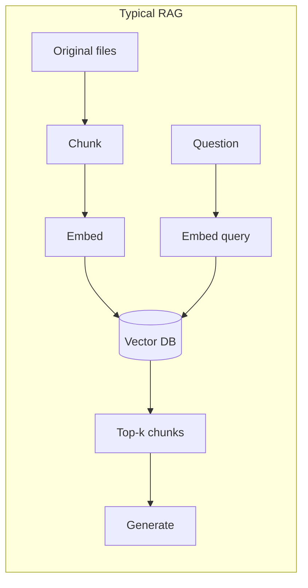
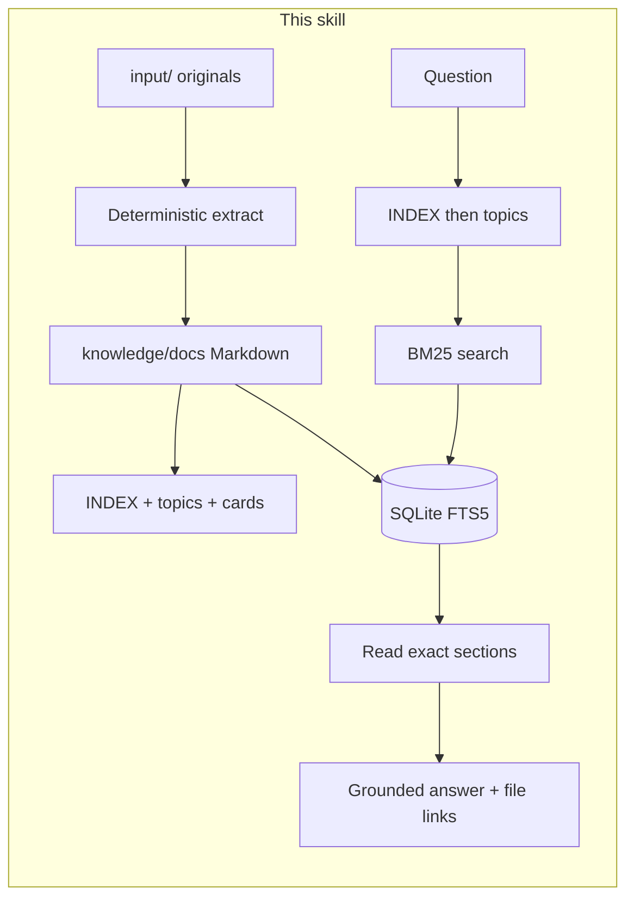
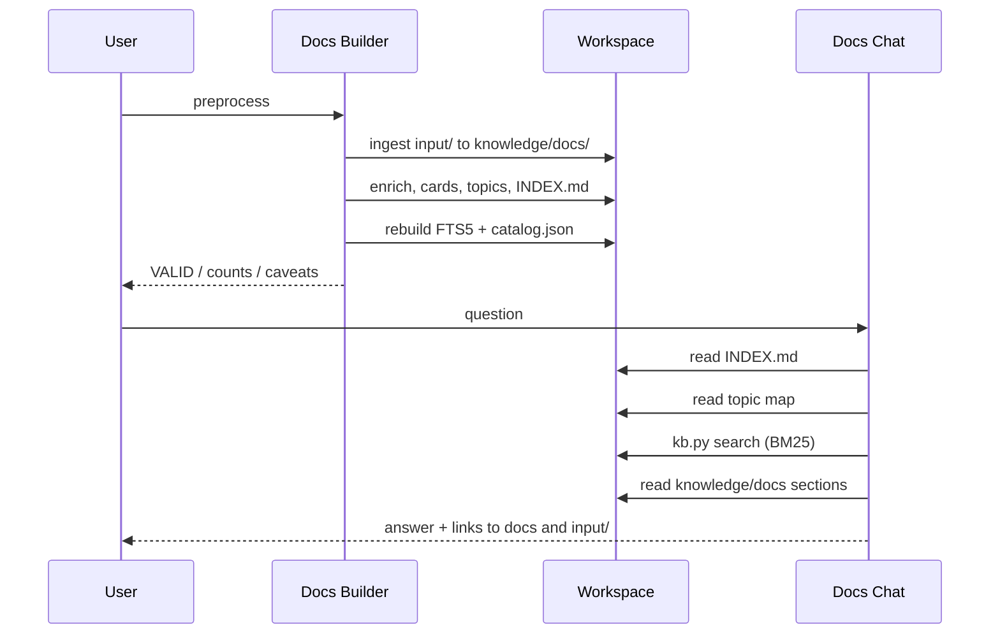
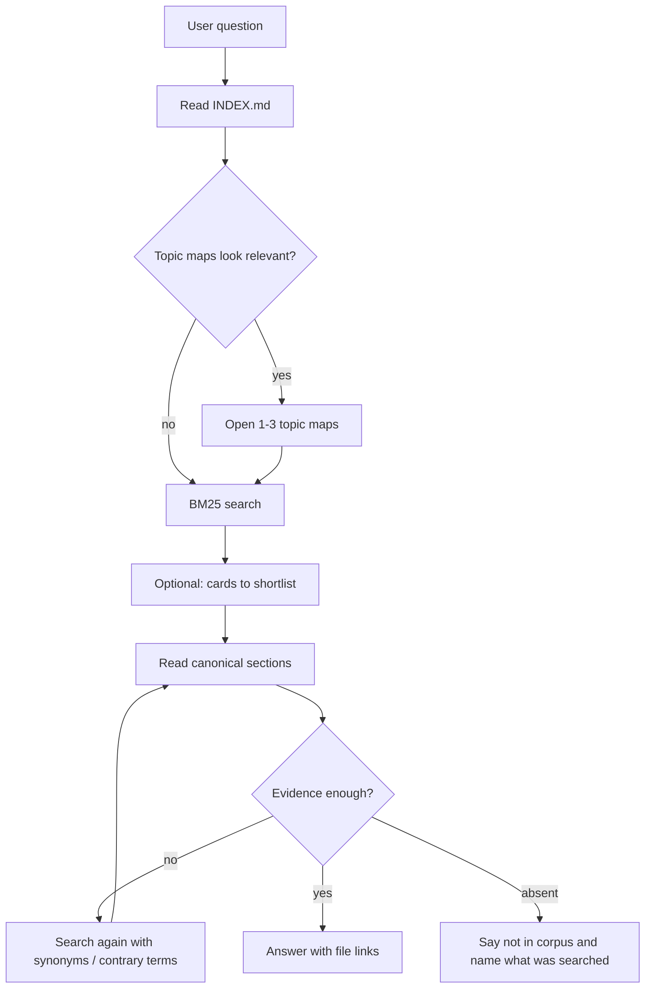
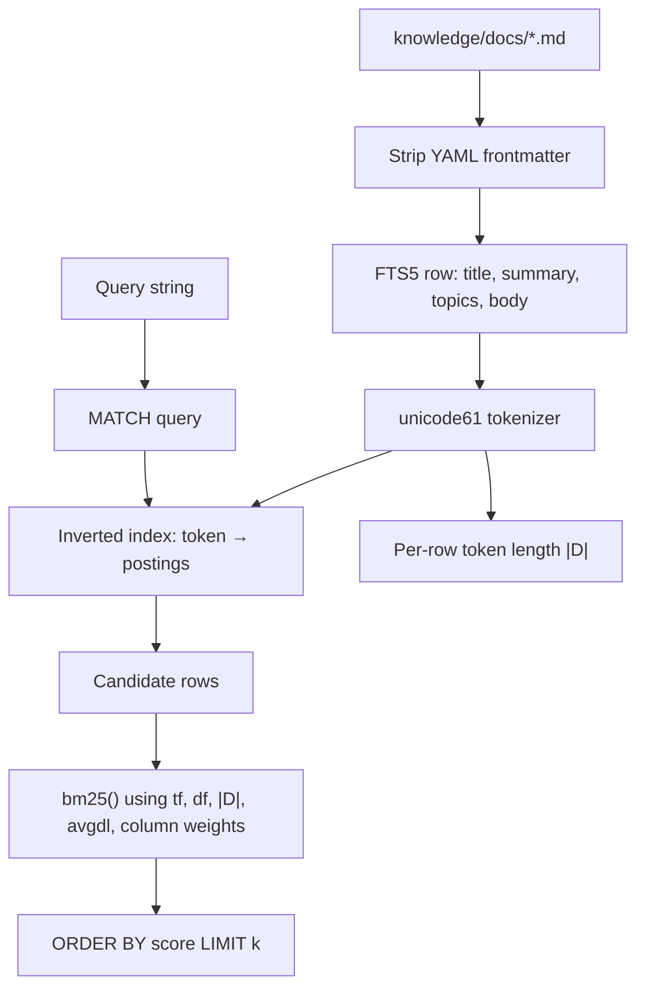
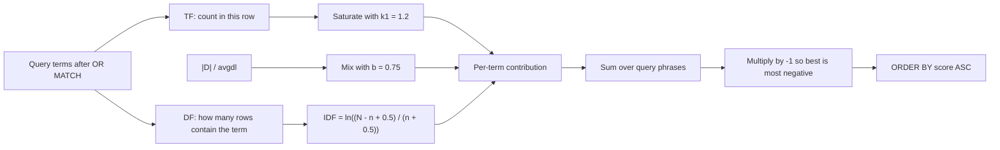
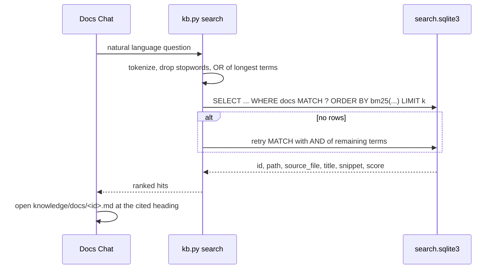

# Technical background

This skill is a **ragless** document knowledge base: convert files to canonical Markdown, map the corpus, then answer from those files. Ranked lookup uses **Okapi BM25** over **SQLite FTS5**. There are no embeddings, no chunk store, and no vector database.

Human entry points: [README.md](README.md) · [cookbook.md](cookbook.md) · agents in the sibling `agents/` folder.

## Why this is designed to beat RAG on a small corpus

Retrieval-augmented generation (RAG) usually means: split documents into chunks, embed each chunk, store vectors, embed the question, return nearest neighbors, then generate. That stack is built for *large, weakly structured* collections where you cannot read the sources.

This kit assumes the opposite: about tens to low thousands of documents, with real filenames, headings, and conflicts. On that shape, RAG’s usual costs show up as quality bugs, not just infra:

| RAG default | What goes wrong on a small policy/docs set | What this skill does instead |
| --- | --- | --- |
| Chunking | A rule and its exception land in different chunks; the model never sees both | One canonical Markdown file per source; the agent reads the **section** |
| Embedding similarity | Near-paraphrase of the question, not the rare identifier (`Credit-Decision-v4`, `$250,000`) | Lexical BM25: rare tokens have high IDF and dominate the ranking |
| Top-k chunks as “context” | The generator treats retrieved text as a bag; disagreements get averaged | Progressive navigation + explicit conflict protocol |
| Opaque chunk IDs | Citations are hard to verify | Markdown links to `knowledge/docs/<id>.md` **and** `input/<file>` |
| Extra model + index | Embedding drift, re-index cost, privacy | Local SQLite file rebuilt in seconds |

RAG still wins when the question and the answer share *no* tokens (pure paraphrase, cross-language, “what’s this about?” with no keywords). The chat protocol compensates with synonym re-search and topic maps — not with vectors.





The generator never answers from a card or from the BM25 snippet. Those are navigation. Evidence is always the canonical Markdown (and, via provenance, the original file).

## The agent pair and the data model

**Docs Builder** and **Docs Chat** are a pair. Builder writes the knowledge base; Chat is the only agent that answers questions from it.



Workspace layout (next to the project, not inside this skill folder):

```text
input/                 originals (never the citable text)
knowledge/
  docs/                canonical Markdown + YAML provenance
  cards/               short navigation notes (not evidence)
  topics/              topic maps (not evidence)
  INDEX.md             corpus map — first read on every Q&A turn
  catalog.json         machine catalog
  .kb/
    manifest.json      ingest hashes / orphan flags
    search.sqlite3     disposable FTS5 index
```

Rebuild may delete and recreate `search.sqlite3`. Canonical Markdown is the source of truth; the index is a cache.

## Progressive retrieval (not “stuff the prompt”)

Docs Chat is forbidden from loading the whole corpus. Order:

1. `knowledge/INDEX.md` — what exists, who is authoritative, known conflicts
2. Relevant `knowledge/topics/*.md`
3. `kb.py search` (BM25 / FTS5)
4. Cards only to triage
5. Exact headings in `knowledge/docs/`
6. Re-search with synonyms, entities, dates, contrary terms if recall looks thin



This is closer to how a person uses a small filing cabinet than to nearest-neighbor RAG: **structure first, keyword search second, quote the file third**.

## SQLite FTS5

[FTS5](https://www.sqlite.org/fts5.html) is SQLite’s full-text virtual table. `rebuild` creates:

```sql
CREATE VIRTUAL TABLE docs USING fts5(
  id UNINDEXED,
  path UNINDEXED,
  source_file UNINDEXED,
  title,
  summary,
  topics,
  body,
  tokenize = 'unicode61'
);
```

`UNINDEXED` columns are stored and returned, but they are **not** tokenized into the inverted index (and we pass them weight `0` in `bm25()` so they cannot affect rank even if they were).

### What FTS5 stores

For every indexed column, FTS5 builds an **inverted index**: token → list of `(rowid, column, positions)`. A separate docsize structure stores token counts per row so BM25 can use document length \( |D| \) and the corpus average \( \mathrm{avgdl} \).



### Tokenizer (`unicode61`)

The unicode61 tokenizer keeps letters and digits (Unicode identifiers) and splits on punctuation and whitespace. Hyphens **split**: `Credit-Decision-v4` becomes `credit`, `decision`, `v4`. That is why planted eval tokens are written as a single alphanumeric word (`qkasset0042`) when we need an unambiguous IDF spike.

FTS5 `MATCH` is a boolean full-text query (`token`, `token1 OR token2`, `token1 AND token2`, prefixes, phrases in quotes). It does **not** rank. Ranking is a separate auxiliary function.

### How this skill turns a question into MATCH

From `scripts/kb.py`:

1. Pull `[A-Za-z0-9_]+` tokens.
2. Drop stopwords (`the`, `what`, `document`, …) and FTS operators (`and`, `or`, `not`, `near`).
3. Drop tokens shorter than 2 characters.
4. Keep unique terms, sort by **length descending**, take 10, join with **`OR`**.

Example: *“What is the validation frequency for challenger models?”* →  
`validation OR frequency OR challenger OR models`  
(stopwords removed; longest distinctive words first so rare terms are not crowded out of the 10-term cap).

If that OR query returns no rows, retry with **`AND`** of up to eight terms (stricter). `MATCH` failures fall back to a quoted string.

OR-first is deliberate: AND over a long natural-language question was too strict on the sample corpus (every remaining term had to appear). OR + BM25 lets a document win on the *rare* terms even if it misses a generic one.

## BM25

BM25 (Best Match 25, Okapi) is a **probabilistic lexical ranker**. It scores a document \( D \) for query \( Q = \{ q_1, \ldots, q_n \} \) using three ideas:

1. **Term frequency (TF)** — more occurrences of \( q_i \) in \( D \) should help, but with **diminishing returns**.
2. **Inverse document frequency (IDF)** — a term that appears in few documents is more informative than a term that appears in almost every document.
3. **Length normalization** — a long document should not win just because it has more room to repeat words.

### Classic Okapi BM25 (positive = better)

For each query term \( q_i \):

\[
\mathrm{IDF}(q_i)=\ln\left(\frac{N-n(q_i)+0.5}{n(q_i)+0.5}+1\right)
\]

\[
\mathrm{score}(D,Q)=\sum_{i=1}^{n}\mathrm{IDF}(q_i)\cdot\frac{f(q_i,D)\,(k_1+1)}{f(q_i,D)+k_1\left(1-b+b\cdot\frac{|D|}{\mathrm{avgdl}}\right)}
\]

| Symbol | Meaning |
| --- | --- |
| \( N \) | Number of documents in the collection |
| \( n(q_i) \) | Number of documents that contain \( q_i \) (document frequency) |
| \( f(q_i,D) \) | Occurrences of \( q_i \) in document \( D \) |
| \( \|D\| \) | Length of \( D \) in tokens |
| \( \mathrm{avgdl} \) | Average \( \|D\| \) in the collection |
| \( k_1 \) | TF saturation (typical \( 1.2 \)) |
| \( b \) | Length-normalization strength (typical \( 0.75 \); \( b=0 \) ignores length) |

The Wikipedia “\(+1\)” inside the log keeps IDF positive when a term occurs in more than half the collection. The older Robertson–Sparck Jones form omits the \( +1 \) and can go negative; FTS5 uses that older log (below) and relies on the rest of the formula plus the \( -1 \) multiplier.

**TF saturation.** As \( f \to \infty \), the fraction approaches \( k_1+1 \). Repeating “validation” fifty times cannot dominate a single hit of a rare identifier.

**Length.** If \( |D| \gg \mathrm{avgdl} \), the denominator grows and raw TF is discounted. Short, on-topic files are not drowned by a 100-page PDF that mentions the query words in passing.



### What SQLite FTS5 actually computes

From the [FTS5 `bm25()` documentation](https://www.sqlite.org/fts5.html#the_bm25_function):

\[
\mathrm{bm25}(D,Q)=-1\sum_{i=1}^{n_{\mathrm{phrase}}}\mathrm{IDF}(q_i)\cdot\frac{f(q_i,D)\,(k_1+1)}{f(q_i,D)+k_1\left(1-b+b\cdot\frac{|D|}{\mathrm{avgdl}}\right)}
\]

with hard-coded \( k_1 = 1.2 \) and \( b = 0.75 \), and

\[
\mathrm{IDF}(q_i)=\ln\left(\frac{N-n(q_i)+0.5}{n(q_i)+0.5}\right)
\]

The leading \( -1 \) is an FTS5 convenience: SQL `ORDER BY` is ascending by default, so **more relevant ⇒ more negative ⇒ sorts first**. This skill therefore does `ORDER BY score LIMIT k` and does not negate again in Python.

### Column weights (this skill)

Phrase frequency is not a raw count when extra arguments are passed to `bm25()`:

\[
f(q_i,D)=\sum_c w_c\cdot n(q_i,c)
\]

\( w_c \) is the weight for column \( c \); \( n(q_i,c) \) is the count of phrase \( i \) in that column. A hit in a column with weight \( 4 \) counts as four hits in a column with weight \( 1 \).

This skill calls:

```sql
bm25(docs, 0, 0, 0, 4.0, 1.5, 2.0, 1.0)
```

| Argument | Column | Weight | Role |
| --- | --- | --- | --- |
| 1 | `id` | 0 | Stored only |
| 2 | `path` | 0 | Stored only |
| 3 | `source_file` | 0 | Stored only |
| 4 | `title` | **4.0** | Filename / title match is strongest |
| 5 | `summary` | **1.5** | Agent-written frontmatter summary |
| 6 | `topics` | **2.0** | Topic tags |
| 7 | `body` | **1.0** | Full extracted text |

So a title hit outweighs a body hit, and a topic-tag hit outweighs an ordinary body mention. That is lexical analogue of a “title field boost” in Elasticsearch, not a neural cross-encoder.

Snippets for the CLI come from FTS5 `snippet(docs, 6, '[', ']', ' … ', 18)` — column index `6` is `body`. Highlighted fragments are for humans scanning search output; they are not the answer.

## End-to-end search call



Rebuild is:

```bash
uv run python .github/skills/ragless-kb/scripts/kb.py rebuild
```

Eval (`eval --k 5`) measures whether the gold document id appears in the top \( k \) BM25 hits, and whether gold strings occur in that canonical Markdown — retrieval and extraction, not generation.

## When BM25 is the wrong tool

- The user paraphrases with **no overlapping content words** and no identifier.
- Scanned PDFs with little extracted text (ingest will warn; FTS5 cannot index pixels).
- Need for *semantic* clustering (“documents like this”) rather than *find this fact*.

Mitigations already in the skill: topic maps, INDEX, synonym re-search, reading full sections after a hit. Adding embeddings would reintroduce the RAG failure modes this design is avoiding. Do not add a vector index unless the user explicitly wants a hybrid ranker.

## Further reading

- Robertson & Zaragoza, *The Probabilistic Relevance Framework: BM25 and Beyond* (Foundations and Trends in IR, 2009)
- [SQLite FTS5](https://www.sqlite.org/fts5.html), especially [the `bm25()` function](https://www.sqlite.org/fts5.html#the_bm25_function)
- [Okapi BM25](https://en.wikipedia.org/wiki/Okapi_BM25)
- Chat behavior: [references/chat.md](references/chat.md) · [references/qa-protocol.md](references/qa-protocol.md)
